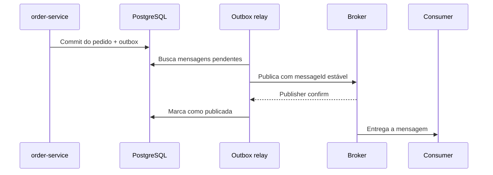

# 5. Comunicação assíncrona e mensageria

**A comunicação assíncrona reduz o acoplamento temporal: produtor e consumidor não precisam estar disponíveis ao mesmo tempo. Porém, ela introduz:**

- _Consistência eventual, Mensagens duplicadas, Eventos fora de ordem, Backlog, Retries, DLQ, Evolução de contratos, Maior complexidade de observabilidade._


- Mensageria não elimina falhas distribuídas; ela muda como essas falhas são tratadas.

---

## 5.1 Modelos de comunicação

## Fila
```text
                    ┌─ pagamento-service instância 1
Producer → Fila ────┼─ pagamento-service instância 2
                    └─ pagamento-service instância 3
```
**As instâncias competem pelas mensagens. Em condições normais, apenas uma delas processa cada entrega.**  

### É adequada quando:

* _Existe um responsável claro pelo processamento, O produtor não precisa esperar o resultado imediatamente, Você quer absorver picos de tráfego._

#### Tecnologias:

* _RabbitMQ, Amazon SQS, ActiveMQ, IBM MQ._

#### _Uma fila não significa necessariamente ordem FIFO estrita. Concorrência, retries e redelivery podem alterar a ordem de conclusão._

---

## Publish/subscribe

No modelo publish/subscribe, um produtor publica uma mensagem e vários consumidores lógicos recebem sua própria cópia.

```text
                        ┌─ fila do pedido-service
PagamentoAprovado ──────┼─ fila do notificacao-service
                        └─ fila do analytics-service
```
- **_Se dois consumidores consumirem da mesma fila, eles competirão pelas mensagens:_**

```text
pagamento.aprovado
    ├── pedido.pagamento-aprovado
    ├── notificacao.pagamento-aprovado
    └── analytics.pagamento-aprovado
```

### Implementações:

* RabbitMQ: exchange roteando para várias filas.
* Kafka: grupos de consumidores diferentes lendo o mesmo tópico.
* AWS: SNS ou EventBridge distribuindo para filas SQS.

_**O SNS representa um tópico pub/sub gerenciado. Os publishers enviam ao tópico e o SNS entrega às assinaturas.**_

---

## Event stream

Um event stream é um log distribuído de eventos.

```text
Offset:     0                 1                   2
Evento: OrderCreated → PaymentApproved → OrderCompleted
```
Diferentemente de uma fila tradicional:

* Consumir não apaga o evento, ficam retidos por tempo ou tamanho.
* Cada grupo mantém sua própria posição, Um consumidor pode reler eventos antigos.

### Kafka combina dois comportamentos:

* Mesmo grupo: consumidores competem pelas partições.
* Grupos diferentes: cada grupo lê todos os eventos independentemente.

```text
Topic: payment-events

Grupo order-service
    ├── instância 1
    └── instância 2

Grupo notification-service
    ├── instância 1
    └── instância 2
```

O evento continua no tópico depois de ser lido. A posição de cada grupo é controlada por offsets.  
### Comparação

| Característica            | Fila                      | Pub/sub                   | Event stream                         |
| ------------------------- | ------------------------- | ------------------------- | ------------------------------------ |
| Destino                   | Um consumidor lógico      | Vários assinantes         | Vários grupos                        |
| Consumo remove a mensagem | Normalmente sim           | Depende                   | Não                                  |
| Replay                    | Normalmente não           | Normalmente não           | Sim                                  |
| Escala                    | Consumidores concorrentes | Assinaturas independentes | Partições e grupos                   |
| Uso típico                | Trabalho e comandos       | Divulgação de eventos     | Histórico e processamento de eventos |
| Exemplos                  | RabbitMQ, SQS             | SNS, exchanges RabbitMQ   | Kafka                                |

---
 

### Fluxo

| Etapa | Serviço | Ação |
|---:|---|---|
| 1 | `pedido-service` | Publica `ProcessarPagamento` |
| 2 | `pedido-service` | Informa `correlationId: K` e `replyTo: payment-replies` |
| 3 | `pagamento-service` | Consome e processa a solicitação |
| 4 | `pagamento-service` | Publica `PagamentoProcessado` em `payment-replies` |
| 5 | `pedido-service` | Usa o `correlationId: K` para localizar a solicitação original |
| 6 | `pedido-service` | Atualiza o estado do pedido |

 

# 5.2 Componentes de um broker

## Producer

- Aplicação que cria e publica a mensagem.

- _Um retorno de sucesso do broker significa, no máximo, que o broker aceitou a mensagem dentro da garantia configurada. Não significa que o consumidor a processou._

#### No RabbitMQ existem dois mecanismos diferentes:

* Publisher confirm: broker confirma ao produtor.
* Consumer acknowledgement: consumidor confirma ao broker.

Eles são independentes.

---

## Consumer

Aplicação que recebe e processa mensagens.

Responsabilidades:

* Desserializar, Validar o contrato, e Executar a regra de negócio.
* Ser idempotente, Confirmar somente após persistir o resultado.
* Propagar tracing e correlation ID.

No Spring AMQP, `AcknowledgeMode.AUTO` significa que o container envia `ack` quando o listener termina normalmente e `nack` quando lança exceção. Não confunda com o `autoAck` do RabbitMQ, que corresponde ao modo `NONE` no Spring. [Modos de acknowledgement do Spring AMQP](https://docs.spring.io/spring-amqp/api/org/springframework/amqp/core/AcknowledgeMode.html)

---

## Broker

Infraestrutura intermediária que pode:

* Receber mensagens.
* Armazená-las.
* Roteá-las.
* Replicá-las.
* Entregá-las.
* Controlar retenção.
* Gerenciar redelivery.
* Isolar produtores de consumidores.


## Topic

O significado depende da tecnologia.

### Kafka

Topic é um log dividido em partições:

```text
payment-events
    ├── partition 0
    ├── partition 1
    └── partition 2
```

### SNS

Topic é um canal de publicação com várias assinaturas.

### RabbitMQ

Um `topic exchange` é um roteador baseado em padrões de routing key. O exchange normalmente não é o armazenamento; as filas armazenam as mensagens.

Portanto, não trate “topic” como um conceito idêntico entre todas as ferramentas.

---

## Queue

Armazena mensagens que ainda precisam ser processadas.

No RabbitMQ:

```text
exchange → binding → queue → consumer
```

No SQS:

```text
producer → queue → consumidores fazendo polling
```

No Kafka não existe uma queue clássica no mesmo sentido. Um tópico com um único consumer group produz comportamento semelhante a uma fila de trabalho.

---

## Partition

Partição é a unidade de paralelismo e ordenação do Kafka.

Considere um tópico com três partições:

```text
Partition 0 → consumidor A
Partition 1 → consumidor B
Partition 2 → consumidor C
```

No consumer group tradicional:

* Uma partição é atribuída a apenas um consumidor do grupo por vez.
* Um consumidor pode possuir várias partições.
* Mais consumidores do que partições deixam consumidores sem trabalho.

Aumentar partições aumenta o paralelismo, mas torna mais difícil oferecer qualquer noção de ordem global.

---

## Offset

É a posição de um registro dentro de uma partição Kafka.

```text
Partition 0

offset 42 → PaymentCreated
offset 43 → PaymentApproved
offset 44 → PaymentCaptured
```

O consumer group registra o próximo offset que deverá consumir.

Se o processamento terminou, mas o offset não foi confirmado:

```text
processou → aplicação caiu → offset não confirmado
```

- O registro será lido novamente.


Se o offset for confirmado antes do efeito de negócio:

```text
offset confirmado → aplicação caiu → efeito não realizado
```

- A mensagem pode ser efetivamente perdida para aquele grupo.

---

## Consumer group

Agrupa consumidores que cooperam para processar um tópico.

### Mesmo grupo

```text
groupId = order-service
```

As instâncias dividem as partições.

### Grupos diferentes

```text
groupId = order-service
groupId = notification-service
```

Cada grupo lê todos os eventos independentemente.

No RabbitMQ e no SQS, o comportamento equivalente é obtido colocando instâncias concorrentes na mesma fila. Para que outra aplicação receba todas as mensagens, ela precisa de outra fila.

---

## Acknowledgement

Confirma que uma entrega pode ser considerada concluída.

| Tecnologia   | Confirmação do consumidor                    |
| ------------ | -------------------------------------------- |
| RabbitMQ     | `basic.ack`                                  |
| Kafka        | Commit do offset                             |
| SQS          | `DeleteMessage`                              |
| Spring AMQP  | Container envia ack após o listener          |
| Spring Kafka | Container gerencia commit conforme `AckMode` |

No SQS, receber a mensagem apenas a torna invisível temporariamente. Se o consumidor não executar `DeleteMessage` antes do visibility timeout, ela reaparece e pode ser entregue novamente. [Visibility timeout do Amazon SQS](https://docs.aws.amazon.com/AWSSimpleQueueService/latest/SQSDeveloperGuide/sqs-visibility-timeout.html)

---

## Retenção

Define por quanto tempo a mensagem fica armazenada.

### RabbitMQ e SQS

Em geral, a mensagem permanece até:

* Ser confirmada ou deletada.
* Expirar.
* Atingir alguma política de retenção.
* Ser enviada para DLQ.
* Ser descartada por limite.

### Kafka

Os registros permanecem conforme:

* Retenção por tempo.
* Retenção por tamanho.
* Log compaction.

O consumo não remove o registro. Isso permite replay.

---

## Dead Letter Queue

A DLQ recebe mensagens que não puderam ser processadas depois da política de retry.

```text
fila principal
    ↓ falha
retry 1
    ↓ falha
retry 2
    ↓ falha
DLQ
```

Ela deve guardar:

* Payload original.
* Message ID.
* Tipo e versão.
* Motivo da falha.
* Stack trace ou código do erro.
* Quantidade de tentativas.
* Primeira e última tentativa.
* Fila ou tópico original.
* Correlation ID.
* Identificação do consumidor.


RabbitMQ usa dead letter exchanges para rotear mensagens rejeitadas, expiradas ou excedidas para outra fila.

O SQS possui DLQs configuradas por redrive policy. 

---

# 5.3 Garantias de entrega
## At-most-once

A mensagem é processada zero ou uma vez.

```text
broker entrega
    ↓
mensagem considerada confirmada
    ↓
consumer tenta processar
```

Se o consumidor cair depois da confirmação e antes do processamento, a mensagem é perdida.

Vantagem:

* Evita redelivery provocada pelo broker.
* Menor sobrecarga.

Desvantagem:

* Pode perder trabalho.

Adequado para dados descartáveis, como algumas métricas de baixa importância.

---

## At-least-once

A mensagem é entregue uma ou mais vezes.

```text
1. Consumer recebe M.
2. Consumer altera o PostgreSQL.
3. Transação faz commit.
4. Consumer cai antes do ack.
5. Broker entrega M novamente.
```

O broker está correto ao redeliver, porque não recebeu a confirmação. Porém o efeito pode ser duplicado.

Esse é o modelo mais comum para operações importantes.

O Amazon SQS Standard, por exemplo, trabalha com entrega at-least-once e pode entregar duplicatas. 

---

## Exactly-once

Significa que um processamento acontece exatamente uma vez, mas sempre dentro de um limite específico.

Kafka consegue oferecer exactly-once para um fluxo como:

```text
ler do Kafka
    ↓
processar
    ↓
escrever no Kafka
    ↓
confirmar offsets
```

Os registros produzidos e os offsets consumidos podem participar da mesma transação Kafka. O Spring Kafka descreve essa garantia para o fluxo `read → process → write`; a leitura e a execução do código ainda podem ocorrer novamente, mas apenas o resultado Kafka confirmado fica visível. [Exactly-once no Spring Kafka](https://docs.spring.io/spring-kafka/reference/kafka/exactly-once.html)

Isso não inclui automaticamente:

* PostgreSQL.
* Envio de e-mail.
* API de cartão.
* Elasticsearch.
* S3.
* Outro broker.
* Serviço externo.

Portanto:

```text
Kafka exactly-once ≠ negócio inteiro exactly-once
```

### SQS FIFO

A fila FIFO evita duplicação de envios com o mesmo `MessageDeduplicationId` dentro da janela de deduplicação e mantém ordem por `MessageGroupId`. [Deduplicação do SQS FIFO](https://docs.aws.amazon.com/AWSSimpleQueueService/latest/SQSDeveloperGuide/FIFO-queues-exactly-once-processing.html)

Mesmo assim, ainda existe:

```text
consumer grava no banco
consumer cai antes de DeleteMessage
visibility timeout expira
mensagem reaparece
```

Logo, o efeito no banco ainda deve ser idempotente.

---

## Effectively-once

É a abordagem mais realista para efeitos de negócio:

```text
at-least-once
    +
messageId estável
    +
consumidor idempotente
    +
deduplicação
    +
restrições de negócio
    =
efeito realizado uma vez
```

A mensagem pode ser entregue várias vezes, mas o resultado final acontece apenas uma vez.

---

## Inbox ou tabela de mensagens processadas

```sql
CREATE TABLE consumed_message (
    consumer_name VARCHAR(100) NOT NULL,
    message_id UUID NOT NULL,
    processed_at TIMESTAMPTZ NOT NULL DEFAULT now(),

    PRIMARY KEY (consumer_name, message_id)
);
```

O `consumer_name` é importante porque consumidores lógicos diferentes precisam processar o mesmo evento.

```java
@Component
public class PaymentApprovedConsumer {

    private final InboxRepository inboxRepository;
    private final OrderRepository orderRepository;

    @Transactional
    @RabbitListener(queues = "order.payment-approved.v1")
    public void consume(MessageEnvelope<PaymentApproved> message) {
        int inserted = inboxRepository.tryInsert(
                "order-service",
                message.messageId()
        );

        if (inserted == 0) {
            return; // Já processada.
        }

        orderRepository.markAsPaid(
                message.data().orderId(),
                message.data().paymentId()
        );
    }
}
```

O `tryInsert` precisa ser atômico:

```sql
INSERT INTO consumed_message (
    consumer_name,
    message_id
)
VALUES (
    :consumerName,
    :messageId
)
ON CONFLICT DO NOTHING;
```

A inserção na inbox e a alteração do pedido devem ocorrer na mesma transação.

Se a regra falhar:

```text
rollback da alteração
rollback da inbox
mensagem pode ser reentregue
```

Se o banco fizer commit, mas o ack falhar:

```text
mensagem é reentregue
inbox encontra duplicata
efeito não é repetido
ack é enviado
```

Também use restrições do domínio:

```sql
CREATE UNIQUE INDEX uk_payment_provider_operation
ON payment(provider_operation_id);
```

A inbox protege a mensagem. A restrição protege a invariável de negócio.

---

## Transactional Outbox

Existe outro problema: salvar no banco e publicar no broker são duas operações diferentes.

Código inseguro:

```java
@Transactional
public Order createOrder(CreateOrderCommand command) {
    Order order = orderRepository.save(...);

    kafkaTemplate.send(
            "order-events",
            new OrderCreated(order.getId())
    );

    return order;
}
```

Possíveis falhas:

```text
Banco faz commit + publicação falha
→ pedido existe, mas evento não existe.

Publicação acontece + banco faz rollback
→ evento diz que existe um pedido inexistente.
```

A solução é gravar o estado e a mensagem de outbox na mesma transação:

```java
@Transactional
public Order createOrder(CreateOrderCommand command) {
    Order order = orderRepository.save(
            Order.create(command)
    );

    outboxRepository.save(
            OutboxMessage.from(
                    new OrderCreated(
                            UUID.randomUUID(),
                            order.getId(),
                            Instant.now()
                    )
            )
    );

    return order;
}
```

Depois, um relay publica as mensagens:



Ainda pode haver duplicação:

```text
relay publica
relay cai antes de marcar como publicada
relay publica novamente
```

Por isso:

> Outbox evita perda no produtor; inbox/idempotência evita efeito duplicado no consumidor.

---

# 5.4 Ordenação

## Ordem global

Todos os eventos são processados em uma única sequência.

```text
E1 → E2 → E3 → E4
```

Normalmente exige:

* Uma partição.
* Uma fila.
* Processamento serial.
* Um consumidor ativo.

Consequências:

* Baixo paralelismo.
* Gargalo.
* Poison message pode bloquear tudo.
* Recuperações ficam mais lentas.

Raramente um sistema inteiro precisa de ordem global.

---

## Ordem por partição

Kafka garante ordem dentro de uma partição, não entre todas as partições. [Ordenação no Apache Kafka](https://kafka.apache.org/documentation/)

```text
Partition 0: A1 → A2 → A3
Partition 1: B1 → B2 → B3
```

Não existe relação garantida entre `A2` e `B2`.

---

## Ordem por entidade

Normalmente é a ordem realmente necessária.

```text
orderId 100:
    PedidoCriado
    PagamentoConfirmado
    PedidoFinalizado

orderId 200:
    PedidoCriado
    PedidoCancelado
```

Os pedidos 100 e 200 podem ser processados em paralelo. Somente os eventos do mesmo pedido precisam manter sequência.

### Kafka

Use o `orderId` como chave:

```java
kafkaTemplate.send(
        "order-events.v1",
        event.orderId().toString(),
        event
);
```

Para um conjunto fixo de partições, eventos com a mesma chave são enviados para a mesma partição.

Cuidados:

* Não publique alguns eventos com chave e outros sem chave.
* Não espere ordem entre tópicos diferentes.
* Alterar a quantidade de partições pode remapear chaves.
* Vários produtores podem publicar na ordem de chegada ao broker, que não é necessariamente a ordem causal do negócio.
* Criar processamento paralelo dentro do listener pode quebrar a ordem de conclusão.

### SQS FIFO

Use:

```text
MessageGroupId = orderId
MessageDeduplicationId = eventId
```

Mensagens do mesmo `MessageGroupId` são entregues sequencialmente. Grupos diferentes podem ser processados em paralelo. [Lógica de entrega das filas SQS FIFO](https://docs.aws.amazon.com/AWSSimpleQueueService/latest/SQSDeveloperGuide/FIFO-queues-understanding-logic.html)

### RabbitMQ

Uma única fila pode preservar a ordem de entrega em condições normais, mas:

* Múltiplos consumidores podem concluir fora de ordem.
* Redelivery pode reposicionar mensagens.
* Retry pode atrasar uma mensagem enquanto outras avançam.
* Prioridades alteram a sequência.

Para ordem estrita, pode ser necessário:

* Single active consumer.
* Filas particionadas por chave.
* Processamento serial por entidade.
* Controle de versão no consumidor.

---

## Chave de particionamento

Uma boa chave:

* Preserva a ordem necessária.
* Distribui carga.
* Evita partições quentes.

Exemplos:

| Caso                    | Chave possível        |
| ----------------------- | --------------------- |
| Eventos de pedido       | `orderId`             |
| Eventos de conta        | `accountId`           |
| Histórico do cliente    | `customerId`          |
| Movimentação de produto | `productId`           |
| Eventos de tenant       | `tenantId + entityId` |

Uma chave ruim:

```text
country = BR
```

Se quase todos os dados forem brasileiros, uma única partição receberá quase toda a carga.

---

# 5.5 Tecnologias

| Tecnologia   | Modelo principal     | Confirmação         | Ordem                       | Replay                  | Melhor uso                               |
| ------------ | -------------------- | ------------------- | --------------------------- | ----------------------- | ---------------------------------------- |
| RabbitMQ     | Filas e roteamento   | Ack/nack            | Fila, com ressalvas         | Não após ack            | Comandos, filas de trabalho e roteamento |
| SQS Standard | Fila gerenciada      | `DeleteMessage`     | Best effort                 | Não após delete         | Filas AWS de alto volume                 |
| SQS FIFO     | Fila ordenada        | `DeleteMessage`     | Por `MessageGroupId`        | Não após delete         | Comandos que exigem ordem por entidade   |
| Kafka        | Log distribuído      | Commit de offset    | Por partição                | Sim                     | Eventos, integração, streams e histórico |
| SNS          | Pub/sub              | Por assinatura      | FIFO em tópicos compatíveis | Não normalmente         | Fan-out                                  |
| EventBridge  | Event bus com regras | Entrega aos targets | Sem garantia geral          | Com archive configurado | Roteamento AWS/SaaS                      |

EventBridge recebe eventos, compara com regras e envia aos targets correspondentes. [Visão geral do Amazon EventBridge](https://docs.aws.amazon.com/eventbridge/latest/userguide/eb-what-is.html)

Uma arquitetura AWS comum é:

```text
pagamento-service
        ↓
SNS ou EventBridge
        ├── SQS do order-service
        ├── SQS do notification-service
        └── SQS do analytics-service
```

A fila SQS atrás de cada assinatura oferece:

* Buffer independente.
* Escala independente.
* Visibility timeout.
* Retry.
* DLQ.
* Isolamento quando um consumidor está indisponível.

---


# Contrato recomendado para mensagens Java

Não envie entidades JPA nem use serialização nativa Java como contrato externo.

Use JSON, Avro ou Protobuf com um envelope explícito:

```java
public record MessageEnvelope<T>(
        UUID messageId,
        String messageType,
        int schemaVersion,
        String aggregateId,
        long aggregateVersion,
        UUID correlationId,
        UUID causationId,
        Instant occurredAt,
        T data
) {}
```

Responsabilidades:

| Campo              | Uso                                 |
| ------------------ | ----------------------------------- |
| `messageId`        | Deduplicação                        |
| `messageType`      | Identificação do contrato           |
| `schemaVersion`    | Evolução do payload                 |
| `aggregateId`      | Identificação e particionamento     |
| `aggregateVersion` | Ordenação da entidade               |
| `correlationId`    | Agrupar toda a operação distribuída |
| `causationId`      | Indicar qual mensagem causou esta   |
| `occurredAt`       | Horário do fato                     |
| `data`             | Dados do comando ou evento          |

O `messageId` deve permanecer igual durante retries e redeliveries.

O padrão CloudEvents também define metadados comuns para representar eventos de forma independente da tecnologia e possui SDK Java. [Especificação CloudEvents](https://cloudevents.io/)

---

# Métricas essenciais

| Área         | Métricas                                                         |
| ------------ | ---------------------------------------------------------------- |
| Fila         | Quantidade disponível, in-flight e idade da mensagem mais antiga |
| Consumo      | Taxa de processamento, duração e erros                           |
| Retry        | Quantidade de tentativas e sucesso posterior                     |
| DLQ          | Quantidade, entrada por minuto e idade                           |
| Kafka        | Consumer lag, offsets e rebalances                               |
| RabbitMQ     | Ready, unacked, publish rate e ack rate                          |
| SQS          | Mensagens visíveis, não visíveis e idade da mais antiga          |
| Outbox       | Registros pendentes e idade                                      |
| Idempotência | Duplicatas detectadas                                            |
| Ordenação    | Gaps e eventos antigos                                           |
| Negócio      | Pagamentos pendentes, aprovados e reconciliados                  |

A regra mental final é:

> O broker garante entrega dentro de limites específicos. A aplicação garante idempotência, consistência de negócio, evolução do contrato e tratamento do resultado desconhecido.
